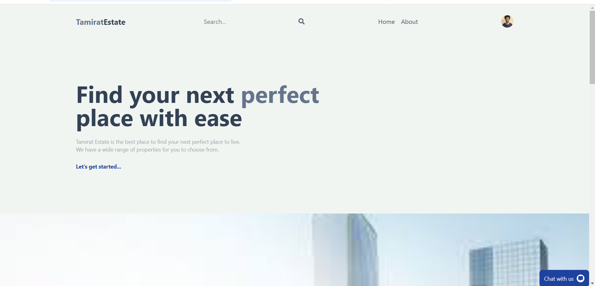
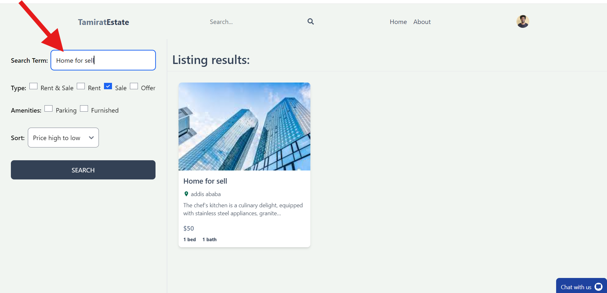
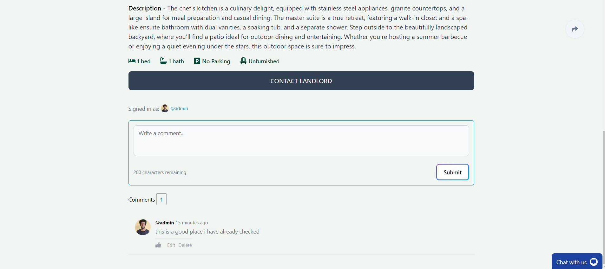
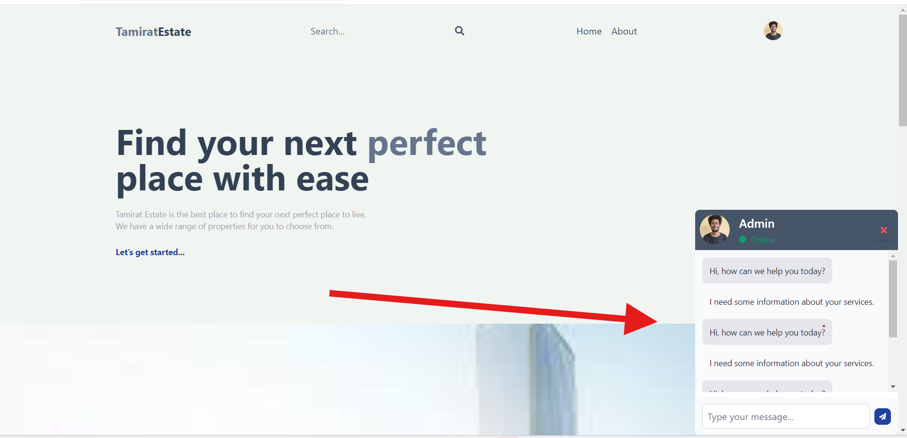

# Tamirat Real Estate  MERN Application

This is a full-stack real estate  application that allows users to create, update, and view property listings. It uses a combination of React, Redux, Tailwind CSS on the frontend, and Node.js, Express, and MongoDB on the backend.

## Table of Contents

- [Tamirat Real Estate  MERN Application](#tamirat-real-estate--mern-application)
  - [Table of Contents](#table-of-contents)
  - [Demo](#demo)
    - [Demo link](#demo-link)
    - [home Page](#home-page)
    - [Filtering RealEstate](#filtering-realestate)
    - [Comment For RealEstate](#comment-for-realestate)
    - [Live Chat With RealEstate Owner](#live-chat-with-realestate-owner)
    - [Admin Dashboard](#admin-dashboard)
  - [Features](#features)
  - [Technologies](#technologies)
    - [Frontend](#frontend)
    - [Backend](#backend)
  - [Installation](#installation)
    - [Prerequisites](#prerequisites)
    - [Backend](#backend-1)
    - [Frontend](#frontend-1)
  - [Usage](#usage)
  - [API Endpoints](#api-endpoints)
    - [User Routes](#user-routes)
    - [Listing Routes](#listing-routes)
  - [License](#license)

## Demo
### Demo link
  - [Demo link](https://youtu.be/FxPN9vLa3EI)
### home Page


### Filtering RealEstate


### Comment For RealEstate



### Live Chat With RealEstate Owner


### Admin Dashboard


## Features

- User authentication
- Create, update, and view property listings
- Image upload functionality with file validation
- Dark mode support
- Live chatting with realestate owner
- commenting on realestate
- Admin dashboard
- Demote and promote Admin 
- and etc.

## Technologies

### Frontend

- React
- Redux & @reduxjs/toolkit
- React Router
- Tailwind CSS

### Backend

- Node.js
- Express.js
- MongoDB
- Mongoose
- multer

## Installation

### Prerequisites

Make sure you have the following installed on your machine:

- Node.js
- npm or yarn
- MongoDB

### Backend

1. Clone the repository:
    ```bash
    git clone https://github.com/kika1s1/Real-State.git
    cd Real-State
    ```

2. Navigate to the backend directory and install dependencies:
    ```bash
    npm install
    ```

3. Create a `.env` file in the `backend` directory with the following content:
    ```env
    MONGO=your_mongodb_connection_string
    JWT_SECRET=your_jwt_secret
    ```


    ```

### Frontend

1. Navigate to the frontend directory and install dependencies:
    ```bash
    cd client
    npm install
    ```

2. to  start both at the same time using concurrently:
    ```bash
    cd ..
    npm run dev
    ```

## Usage

1. Open your browser and navigate to `http://localhost:5173` to view the application.

2. Register a new account or log in with existing credentials.

3. Create, update, and view property listings.

## API Endpoints

### User Routes

- `POST /api/users/register`: Register a new user
- `POST /api/users/login`: Login a user

### Listing Routes

- `POST /api/listings/create`: Create a new listing
- `GET /api/listings/get/:id`: Get a specific listing
- `PUT /api/listings/update/:id`: Update a listing
- `DELETE /api/listings/delete/:id`: Delete a listing
- `POST /api/listings/upload`: Upload listing images


## License

This project is licensed under the MIT License.
